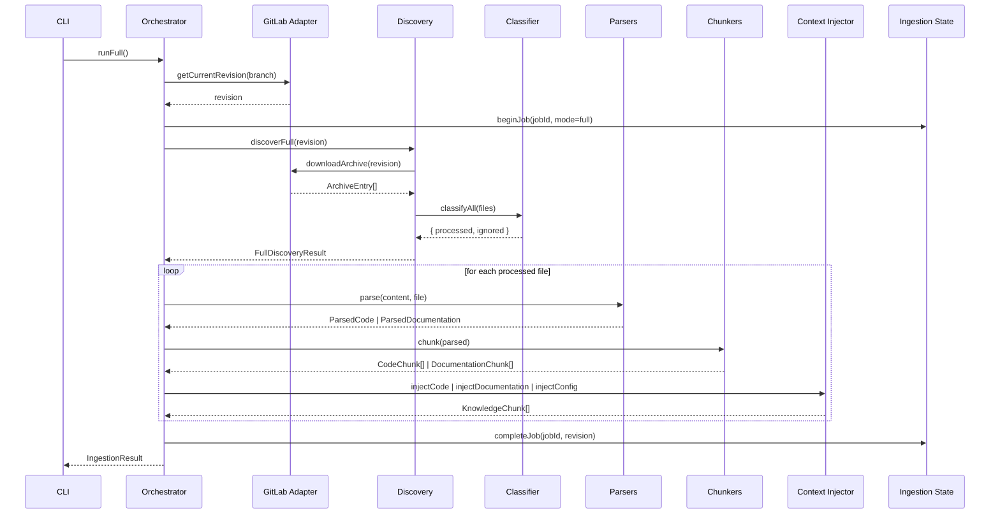
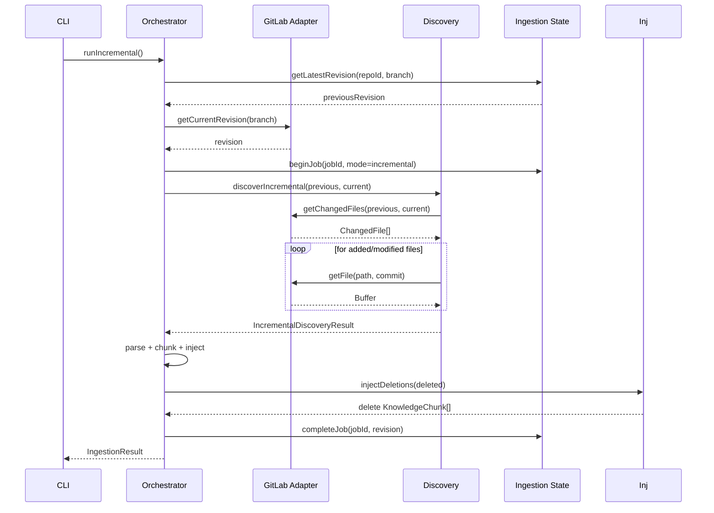

# Architecture

This document describes the architecture of the RAG ingestion layer in more
detail than the README. It is intended for engineers extending the pipeline
with the next phases (security scanner, embedding, vector store).

## Layered design

```
┌────────────────────────────────────────────────────────────────────┐
│ GitLab (or another VCS)                                            │
└────────────────────────────────────────────────────────────────────┘
                           │
                           ▼
┌────────────────────────────────────────────────────────────────────┐
│ Repository Adapter                                                │
│   - getRepositoryInfo()                                           │
│   - getCurrentRevision(branch)                                    │
│   - listFiles(revision)                                           │
│   - getFile(revision)                                             │
│   - getChangedFiles(from, to)                                     │
│   - downloadArchive(revision)                                     │
└────────────────────────────────────────────────────────────────────┘
                           │
                           ▼
┌────────────────────────────────────────────────────────────────────┐
│ File Discovery                                                    │
│   - discoverFull(revision)   → ArchiveEntry[] + ClassificationResult│
│   - discoverIncremental(from, to) → entries + ChangedFile[]       │
└────────────────────────────────────────────────────────────────────┘
                           │
                           ▼
┌────────────────────────────────────────────────────────────────────┐
│ File Classifier                                                   │
│   PROCESS / IGNORE + (CODE | DOCUMENTATION | CONFIG)              │
│   + reason + language                                             │
└────────────────────────────────────────────────────────────────────┘
                           │
                ┌──────────┴───────────┐
                ▼                      ▼
   ┌────────────────────┐  ┌─────────────────────┐
   │ Documentation      │  │ Code                │
   │ Parser             │  │ Parser (tree-sitter)│
   │ (unified +         │  │ TS / TSX / JS /     │
   │  remark-parse)     │  │ JSX / MJS / CJS     │
   └────────────────────┘  └─────────────────────┘
                │                      │
                ▼                      ▼
   ┌────────────────────┐  ┌─────────────────────┐
   │ Documentation      │  │ Code Chunker        │
   │ Chunker            │  │ (semantic, AST-based│
   │ (heading-based,    │  │ with method split)  │
   │  size-fallback)    │  │                     │
   └────────────────────┘  └─────────────────────┘
                │                      │
                └──────────┬───────────┘
                           ▼
                ┌─────────────────────┐
                │ Context Injector    │
                │  → KnowledgeChunk[] │
                └─────────────────────┘
                           │
                           ▼
                ┌─────────────────────┐
                │ Ingestion State     │
                │ (file or memory)    │
                └─────────────────────┘
```

Key design constraints enforced throughout the codebase:

- **No coupling** between layers. Parsers do not know about GitLab; the
  classifier does not know about embedding; the context injector does not
  know about Chroma.
- **No LLM** is used during parsing or chunking. All parsing is done by
  deterministic tooling (remark / tree-sitter).
- **Per-file failures** are isolated by the orchestrator — one bad file
  does not abort the run; failures are reported in the final
  `IngestionResult`.
- **Revision traceability** — every `KnowledgeChunk` carries
  `repositoryId`, `repository`, `service`, `branch`, and `commit` so the
  future embedding / vector-store layer can upsert or delete by revision.

## Modules

### `config/`

A Zod-validated configuration loader that reads environment variables
from `.env` (or `process.env`) and returns a typed
`IngestionConfig`. The loader fails fast at startup if a required value
is missing, with a clear message that points to `.env.example`.

Sensitive configuration (the GitLab token) is **never** logged. The
logger redacts any value whose key matches `token`, `authorization`,
`password`, `secret`, or `private[_-]?key`. A `redactToken` helper is
exposed for ad-hoc use.

### `logger/`

A minimal, dependency-free logger with five levels (`debug`, `info`,
`warn`, `error`, `silent`). It produces ISO timestamps, supports child
loggers for contextual fields, and redacts sensitive values recursively.

### `errors/`

A small hierarchy of typed errors with stable `ErrorCode` strings. The
orchestrator and CLI inspect these codes to decide whether to fail the
run or just log per-file failures.

```
IngestionError
├── ConfigurationError       (CONFIG_MISSING)
├── GitLabAuthError          (GITLAB_AUTH_FAILED)
├── GitLabNotFoundError      (GITLAB_NOT_FOUND)
├── GitLabRateLimitError     (GITLAB_RATE_LIMITED)
├── GitLabApiError           (GITLAB_API_ERROR)
├── GitLabTimeoutError       (GITLAB_TIMEOUT)
├── GitLabArchiveError       (GITLAB_ARCHIVE_ERROR)
├── FileParseError           (PARSE_ERROR)
└── UnsupportedFileError     (UNSUPPORTED_FILE)
```

### `repository/`

`RepositoryAdapter` is the single abstraction over the source-control
host. The only production implementation today is `GitLabRepositoryAdapter`,
which:

- Talks to GitLab via the REST API using `fetch` (with a Node-`https`
  fallback for binary downloads — see "GitLab archive caveat" below).
- Authenticates with `PRIVATE-TOKEN`.
- Implements retries with exponential back-off on 429 / 5xx.
- Walks the repository tree with keyset pagination (`x-next-page`).
- Extracts the `tar.gz` archive to a temporary directory and returns
  `ArchiveEntry[]`.

The adapter validates its inputs at construction time, so a missing
host, token, or project id fails immediately rather than on first use.

#### GitLab archive caveat

Node's bundled `fetch` (undici) negotiates HTTP/2 with the configured
GitLab instance and the instance returns **HTTP 406** for the archive
endpoint in that case. To work around this without adding a dependency,
the archive download uses Node's built-in `https.request` with
`ALPNProtocols: ['http/1.1']`. The same fix would apply to any future
binary endpoint that hits the same content-negotiation bug.

### `discovery/`

- `FileClassifier` — deterministic, extensible classification. The
  default ruleset handles:

  - `IGNORED_DIRECTORIES` (`node_modules/`, `.git/`, `dist/`, `build/`, …)
  - `IGNORED_FILE_PATTERNS` (binary extensions like `.png`, `.pdf`,
    `.woff2`, minified JS, …)
  - `LOCK_FILE_PATTERNS` (toggleable with `ignoreLockFiles: false`)
  - `DOC_EXTENSIONS` (`.md`, `.mdx`, `.markdown`, `.rst`, `.adoc`)
  - `CODE_EXTENSIONS` (TS / TSX / JS / JSX / MJS / CJS / Python / Java / …)
  - `CONFIG_FILE_NAMES` (`package.json`, `tsconfig.json`, `Dockerfile`, …)
  - `DEFAULT_DOCUMENTATION_FILE_NAMES` (`README.md`, `CHANGELOG.md`, …)
  - `DEFAULT_DOCUMENTATION_DIRECTORIES` (`docs/`, `documentation/`)

- `FileDiscovery` — thin wrapper that downloads the archive (full mode)
  or fetches changed files one-by-one (incremental mode), classifies the
  result, and exposes `{ entries, classification, files }` to the
  orchestrator.

### `parsers/`

- `documentation/MarkdownParser` — uses `unified` + `remark-parse` to
  produce an MDAST, then derives `headings`, `codeBlocks`, `links`, and
  `topLevel` views for chunking.

- `code/TreeSitterCodeParser` — wraps `tree-sitter` with the
  `tree-sitter-typescript` and `tree-sitter-javascript` grammars. It
  automatically picks the right grammar from the file extension, sets an
  explicit `bufferSize` (the default 32 KiB is too small for some real
  files), captures positions and names, and exposes both `topLevel`
  declarations and the full `declarations` list (including nested
  methods). When the source contains tree-sitter ERROR nodes, the result
  is returned with a non-fatal `parseError` so the orchestrator can
  decide whether to continue.

### `chunkers/`

- `documentation/DocumentationChunker` — splits a parsed document into
  sections based on heading hierarchy. A section starts at a heading and
  ends just before the next heading of equal-or-shallower depth. Sections
  that exceed `maxChars` are split into overlapping windows of
  `overlapChars` while preserving the heading path.

- `code/CodeChunker` — emits one chunk per top-level declaration (class,
  function, interface, type alias, enum, lexical declaration). When
  `splitMethods: true` (default), each method becomes its own chunk
  qualified by the parent class name (`UserService.findUser`). Each chunk
  embeds the actual source content (`content`) for downstream retrieval.

### `knowledge/`

The canonical `KnowledgeChunk` model and the `ContextInjector` that turns
`CodeChunk[]`, `DocumentationChunk[]`, raw config content, and deleted
files into `KnowledgeChunk[]`.

Every chunk carries:

- `id` — deterministic sha1 derived from `type + repositoryId + branch +
  commit + file + symbol + startLine + endLine`, so re-ingesting the same
  content produces the same id.
- `metadata.repository`, `metadata.service` — derived from the
  url-encoded project id (`group%2FpartServiceFileStorage` →
  `partServiceFileStorage`, `service = FileStorage`).
- `metadata.changeType` — populated by the orchestrator for incremental
  runs.

`injectDeletions` is what makes the pipeline future-friendly: it emits
a `delete` chunk per deleted file with the same id scheme, so a future
vector layer can reconcile by id.

### `state/`

`IngestionState` is the abstraction. It records:

- the latest successfully ingested revision per `(repositoryId, branch)`
- the history of ingestion jobs (running / completed / failed)

The default implementation is `IngestionStateImpl`, which persists to a
JSON file via `FileIngestionStateStore`. Writes are atomic (temp file +
rename). An `InMemoryIngestionStateStore` is provided for tests.

The state is the only input the orchestrator needs to decide between
**full** and **incremental** modes:

- No previous revision → full.
- Previous revision == current revision → skip (or full, when forced).
- Previous revision != current revision → incremental (uses GitLab
  compare to discover changed files).

### `orchestrator/`

`IngestionOrchestrator` is the wiring layer. It takes a set of
`IngestionOrchestratorDeps` (adapter, discovery, state, parsers,
chunkers, context injector, logger) and exposes:

- `run(options)` — picks full / incremental / skipped automatically.
- `runFull(options)` — always does a full ingestion.
- `runIncremental(options)` — always does an incremental ingestion.
  Throws if no previous revision exists.

Each run produces an `IngestionResult` with:

- `mode` (`full` | `incremental` | `skipped`)
- `repository`, `branch`, `revision`, `previousRevision`, `jobId`
- `stats` — discovered / ignored / processed / failed counts plus
  code / documentation / config / delete chunk counts.
- `failures` — per-file failure records (`{ path, stage, error }`).
- `chunks` — the final `KnowledgeChunk[]`.
- `durationMs`, `startedAt`, `completedAt` — observability metadata.

Per-file failures never abort the run. The orchestrator catches, logs a
warning, records the failure, and continues with the next file.

### `security/`

Phase 3 placeholder. `AllowAllSecurityScanner` is the no-op default. The
contract (`SecurityScanner.scan({ filePath, content, language }) → ALLOW |
BLOCK | REDACT`) is in place so a real implementation can be slotted into
the orchestrator without changing the parsers.

### `cli/`

`src/cli/run-ingestion.ts` is the executable entry point. It:

1. Loads and validates configuration.
2. Wires every component together.
3. Parses CLI flags (`--incremental`, `--full`, `--branch=…`).
4. Calls the orchestrator.
5. Prints the result (mode, stats, failures) to stdout.
6. Exits with `0` on success, `1` on fatal errors, `2` on per-file
   failures.

The token is **never** logged or printed.

## Extension points

| Future phase            | Where to plug in                                                         |
| ----------------------- | ------------------------------------------------------------------------ |
| Security Scanner        | `IngestionOrchestrator` — call `scanner.scan(...)` before `processFile`. |
| Other VCS (GitHub, …)   | Implement `RepositoryAdapter` and pass it as `deps.adapter`.             |
| More languages          | Add a grammar to `TreeSitterCodeParser` and extend `CODE_EXTENSIONS`.    |
| Better binary detection | Pass a custom `BinaryDetector` to `FileClassifier`.                      |
| Vector store            | Subscribe to `chunks: KnowledgeChunk[]` in the orchestrator.             |
| Multi-process safety    | Replace `FileIngestionStateStore` with a DB-backed `IngestionStateStore`.|
| Embedding               | Run after the orchestrator returns; the chunk shape is stable.           |

## End-to-end sequence (full ingestion)



## End-to-end sequence (incremental ingestion)



## Observability

The logger is dependency-free and uses structured JSON. Sensitive keys
are redacted recursively. Suggested levels:

- **INFO** — ingestion started / completed, repository, revision, mode.
- **DEBUG** — discovery classification, per-file chunk counts.
- **WARN** — per-file parse failures, skipped files, GitLab rate limits.
- **ERROR** — fatal ingestion errors.

The token is never logged, even when the orchestrator logs the
configured `host` / `branch` / `commit`.

## Testing strategy

- **Unit tests** for the parsers, chunkers, classifier, injector, and
  state (all hermetic, in-memory).
- **Adapter tests** with a mocked `fetch` that simulates 200 / 401 / 403 /
  404 / 429 / 5xx responses and validates the retry / back-off logic.
- **Orchestrator tests** with a `FakeAdapter` that produces synthetic
  archives and compare responses, validating full / incremental / skipped
  / delete scenarios end-to-end without touching GitLab.
